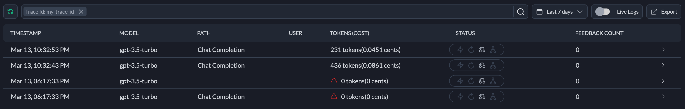

## How to Setup Fallback from OpenAI to Azure OpenAI

Let’s say you’ve built an LLM-based app and deployed it to production. It relies on OpenAI’s gpt-4 model. It’s [Mar 12, 2023](https://status.portkey.ai/incident/339664), and suddenly your users find errors with the functionality of the app — “It doesn’t work!”

It turns out that in the logs, the app has encountered [503 errors](https://platform.openai.com/docs/guides/error-codes) due to overloaded requests on the server-side. What could you do? If you are in such a situation, we have an answer for you: Portkey Fallbacks.

Portkey Fallbacks can automatically switch your app's requests from one LLM provider to another, ensuring reliability by allowing you to fallback among multiple LLMs. This is especially useful given the unpredictable nature of LLM APIs. With Portkey, you can switch to a different LLM provider, such as Azure, when needed, making your app Production-Ready.

In this cookbook, we will learn how to implement a fallback mechanism in our apps that allows us to automatically switch the LLM provider from OpenAI to Azure OpenAI with just a few lines of code. Both providers have the exact same set of models, but they are deployed differently. Azure OpenAI comes with its own deployment mechanisms, which are generally considered to be more reliable.

<span style="text-decoration:underline;">Prerequisites:</span>

1. You have the[ Portkey API Key](https://portkey.ai/docs/api-reference/authentication#obtaining-your-api-key). ([Sign Up](https://portkey.ai))
2. You stored OpenAI and Azure OpenAI API keys as [virtual keys](https://portkey.ai/docs/product/ai-gateway-streamline-llm-integrations/virtual-keys).

## 1. Import the SDK and authenticate with Portkey

We start by importing Portkey SDK into our NodeJS project using npm and authenticate by passing the Portkey API Key.

```js
import { Portkey } from 'portkey-ai';

const portkey = new Portkey({
  apiKey: process.env.PORTKEYAI_API_KEY
});
```

## 2. Create Fallback Configs

Next, we will create a configs object that influences the behavior of the request sent using Portkey.

```js
{
 'strategy': {
    'mode': "fallback",
  },
  'targets': [
    {
      'virtual_key': process.env.OPENAI_VIRTUAL_KEY,
    },
    {
      'virtual_key': process.env.AZURE_OPENAI_VIRTUAL_KEY,
    },
  ],
}
```

This configuration instructs Portkey to use a _fallback_ strategy with the requests. The _targets_ array lists the virtual keys of LLMs in the order Portkey should fallback to an alternative.

Most users find it way more cleaner to define the configs in the Portkey UI and reference the config ID in the code. [Try it out](https://portkey.ai/docs/product/ai-gateway-streamline-llm-integrations/configs#creating-configs).

Add this configuration to the _portkey_ instance to apply the fallback behavior to all the requests.

```javascript
const portkey = new Portkey({
  apiKey: process.env.PORTKEYAI_API_KEY,
  config: {
    strategy: {
      mode: 'fallback'
    },
    targets: [
      {
        virtual_key: process.env.OPENAI_VIRTUAL_KEY
      },
      {
        virtual_key: process.env.AZURE_OPENAI_VIRTUAL_KEY
      }
    ]
  }
});
```

Always reference the credentials from the environment variables to prevent exposure of any sensitive data. Portkey will automatically infer the LLM providers based on the passed virtual keys.

> The Azure OpenAI virtual key only needs to be set up once, and it will then be accessible through Portkey in all subsequent API calls.

<details>

<summary>Fallback Configs without virtual keys</summary>

```json
{
  "strategy": {
    "mode": "fallback"
  },
  "targets": [
    {
      "provider": "openai",
      "api_key": "sk-xxxxxxxxpRT4xxxx5"
    },
    {
      "provider": "azure-openai",
      "api_key": "*******"
    }
  ]
}
```

</details>

## 3. Make a request

All the requests will hit OpenAI since Portkey proxies all those requests to the target(s) we already specified. Notice that the changes to the requests do not demand any code changes in the business logic implementation. Smooth!

```js
const messages = [
  {
    role: 'system',
    content: 'You are a very helpful assistant.'
  },
  {
    role: 'user',
    content: 'Help me plan a birthday'
  }
];

const response = await portkey.chat.completions.create({
  messages,
  model: 'gpt-3.5-turbo'
});

console.log(response.choices[0].message.content); // Here is the plan:...
```

When OpenAI returns any 4xx or 5xx errors, Portkey will automatically switch to Azure OpenAI to ensure the same specified model is used.

## 4. View the Fallback Status in Logs

Since all the requests go through Portkey, Portkey can log them for better observability of your app. You can find the specific requests by passing an _trace ID_. It can be any desired string name. In this case, `my-trace-id`

```js
const response = await portkey.chat.completions.create(
  {
    messages,
    model: 'gpt-3.5-turbo'
  },
  {
    traceID: 'my-trace-id'
  }
);
```

You can apply filter with Trace ID to list requests. Instances when the fallbacks are activated will highlight the fallback icon. The logs can be filtered by cost, tokens, status, config, trace id and so on.



Learn more about [Logs](https://portkey.ai/docs/product/observability-modern-monitoring-for-llms/logs).

## 5. Advanced: Fallback on Specific Status Codes

Portkey provides finer control over the when it should apply fallback strategy to your requests to LLMs. You can define the configuration to condition based on specific status codes returned by the LLM provider.

```js
const portkey = new Portkey({
  apiKey: process.env.PORTKEYAI_API_KEY,
  config: {
    strategy: {
      mode: 'fallback',
      on_status_codes: [429]
    },
    targets: [
      {
        virtual_key: process.env.OPENAI_VIRTUAL_KEY
      },
      {
        virtual_key: process.env.AZURE_OPENAI_VIRTUAL_KEY
      }
    ]
  }
});
```

In the above case for all the request that are acknowledged with the status code of 429 will fallback from OpenAI to Azure OpenAI.

## 6. Considerations

That’s it; you can implement production-grade fallback mechanisms with just a few lines of code. While you are equipped with all the tools to implement fallbacks to your next GenAI app, here are few considerations:

- The implementation of Fallback does not alter the quality of LLM outputs received by your app.
- Azure requires you to deploy specific models. Portkey will automatically trigger the chat completions endpoint using GPT4 if it is available instead of GPT3.5.

<details>

<summary>
See the full code
</summary>

```js
import { Portkey } from 'portkey-ai';

const portkey = new Portkey({
  apiKey: process.env.PORTKEYAI_API_KEY,
  config: {
    strategy: {
      mode: 'fallback'
    },
    targets: [
      {
        virtual_key: process.env.OPENAI_VIRTUAL_KEY
      },
      {
        virtual_key: process.env.AZURE_OPENAI_VIRTUAL_KEY
      }
    ]
  }
});

const messages = [
  {
    role: 'system',
    content: 'You are a very helpful assistant.'
  },
  {
    role: 'user',
    content: 'Help me plan a birthday'
  }
];

const response = await portkey.chat.completions.create({
  messages,
  model: 'gpt-3.5-turbo'
});

console.log(response.choices[0].message.content);
```

</details>
