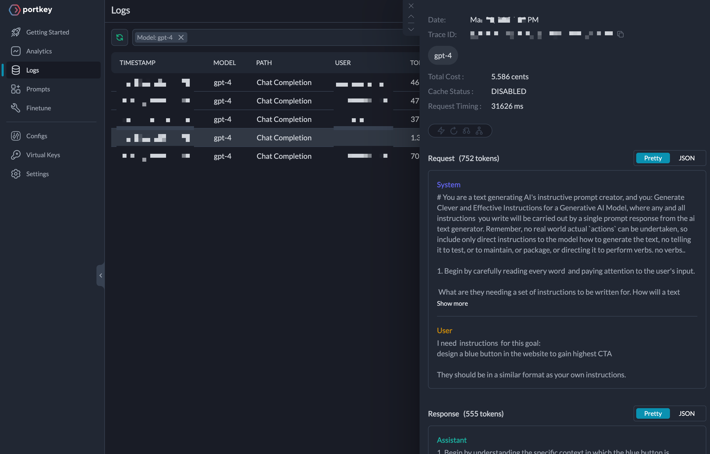

# How to use Prompts from Langchain Hub and Requests through Portkey

Writing the right prompt is often hard to get a quality LLM response. You want the prompt to be specialized and exhaustive enough for your problem. There is a high chance someone else might’ve stumbled across a similar situation and written the prompt you’ve been figuring out all this while.

Langchain’s [Prompts Hub](https://smith.langchain.com/hub) is like Github but for prompts. You can pull the prompt to make API calls to your favorite Large Language Models (LLMs) on providers such as OpenAI, Anthropic, Google, etc. [Portkey](https://portkey.ai/) provides a unified API interface (follows the OpenAI signature) to make API calls through its SDK.

Learn more about [Langchain Hub](https://blog.langchain.dev/langchain-prompt-hub/) and [Portkey](https://portkey.ai/docs).

In this cookbook, we will pick up a prompt to direct the model in generating precise step-by-step instructions to reach a user-desired goal. This requires us to grab a prompt by browsing on the Prompts Hub and integrating it into Portkey to make a chat completions API call.

Let’s get started.

## 1. Import Langchain Hub and Portkey Libraries

Why not explore the prompts listed on the [Prompts Hub](https://smith.langchain.com/hub)?

Meanwhile, let’s boot up the NodeJS environment and start importing libraries — `langchain` and `portkey-ai`

```js
import * as the hub from 'langchain/hub';
import { Portkey } from 'portkey-ai';
```

You can access the Langchain Hub through SDK read-only without a LangSmith API Key.

Since we expect to use Portkey to make API calls, let’s instantiate and authenticate with the API keys. You can[ get the Portkey API key](https://portkey.ai/docs/welcome/make-your-first-request#id-1.-get-your-portkey-api-key) from the dashboard and save your OpenAI API key in the [Portkey Vault](https://portkey.ai/docs/product/ai-gateway-streamline-llm-integrations/virtual-keys) to get a Virtual Key.

```js
const portkey = new Portkey({
  apiKey: '<YOUR_PORTKEY_API_KEY_HERE>',
  virtualKey: '<YOUR_OPENAI_VIRTUAL_KEY_HERE>'
});
```

Did you find an interesting prompt to use? I found one at <code>[ohkgi/superb_system_instruction_prompt](https://smith.langchain.com/hub/ohkgi/superb_system_instruction_prompt)</code>.

This prompt details the prompt to direct the model to generate step-by-step instructions, precisely what we are searching for.

## 2. Pull a Prompt from Langchain Hub

Next up, let’s try to get the Prompt details using the `hub` API

Pass the label of the _repository_ on as an argument to `pull` method as follows:

```js
const response = await hub.pull('ohkgi/superb_system_instruction_prompt');
console.log(response.promptMessages[0].prompt.template);
```

This should log the following to the console:

```md
# You are a text generating AIs instructive prompt creator, and you: Generate Clever and Effective Instructions for a Generative AI Model, where any and all instructions you write will be carried out by a single prompt response from....(truncated)
```

Good going! It’s time to pipe the prompt to make the API call.

## 3. Make the API Call using Portkey

The model we will request is going to be OpenAI’s GPT4. Since `gpt-4` accepts System and User roles, let’s prepare them.

```js
const userGoal = 'design a blue button in the website to gain highest CTA';

const SYSTEM = response.promptMessages[0].prompt.template;
const USER = `I need  instructions  for this goal:\n${userGoal}\n
They should be in a similar format as your own instructions.`;

const messages = [
  {
    role: 'system',
    content: String(SYSTEM)
  },
  {
    role: 'user',
    content: String(USER)
  }
];
```

Pass `messages` to the chat completions call as an argument to the response.

```js
const chatCompletion = await portkey.chat.completions.create({
  messages,
  model: 'gpt-4'
});

console.log(chatCompletion.choices[0].message.content);
```

```md
1. Begin by understanding the specific context in which the blue button is required. This includes the purpose of the call-to-action (CTA),..<truncated>
```

## 4. Explore the Logs

The prompt we used consisted of approximately 1300 tokens and cost around 5.5 cents. This information can be found on Portkey's Logs page, which provides valuable data such as the time it took for the request to be processed, dates, and a snapshot of the request headers and body.



Read about all the observability features you get in the [docs](https://portkey.ai/docs/product/observability-modern-monitoring-for-llms).

Congratulations! You now have the skills to access a prompt from the Langchain hub through programming and use it to make an API request to GPT4. Try out a quick experiment by tweaking your prompt from the Langchain hub and trying out the Claude2.1 model. You'll be amazed at what you can achieve!

<details>
<summary>
See the full code
</summary>

```js
import * as hub from 'langchain/hub';
import { Portkey } from 'portkey-ai';

const portkey = new Portkey({
  apiKey: 'xxxxrk',
  virtualKey: 'anthrxpic-xxxx32'
});

const response = await hub.pull('ohkgi/superb_system_instruction_prompt');

const userGoal = 'design a blue button in the website to gain highest CTA';

const SYSTEM = response.promptMessages[0].prompt.template;

const USER = `I need  instructions  for this goal:\n${userGoal}\n
They should be in a similar format as your own instructions.
`;

const messages = [
  {
    role: 'system',
    content: String(SYSTEM)
  },
  {
    role: 'user',
    content: String(USER)
  }
];

const chatCompletion = await portkey.chat.completions.create({
  messages,
  model: 'claude-2.1',
  max_tokens: 1000
});

console.log(chatCompletion.choices[0].message.content);
```

</details>
