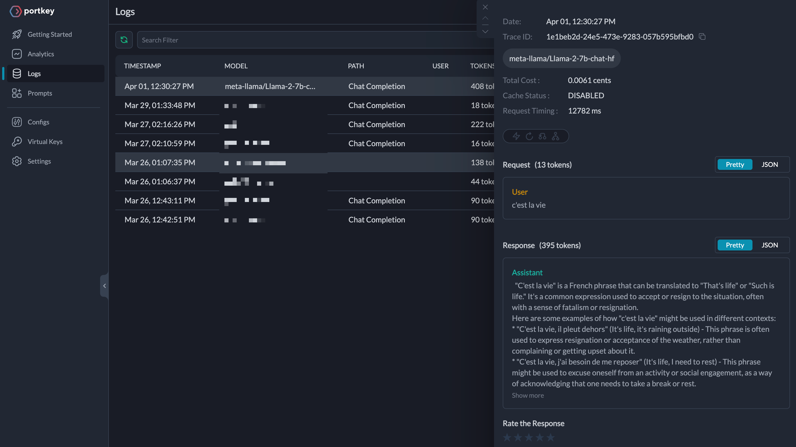
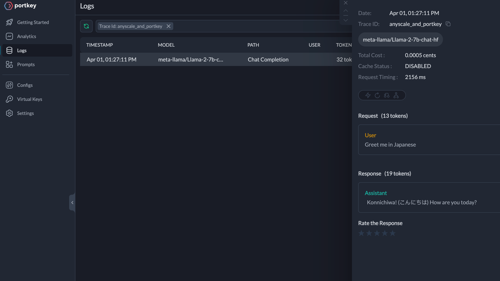
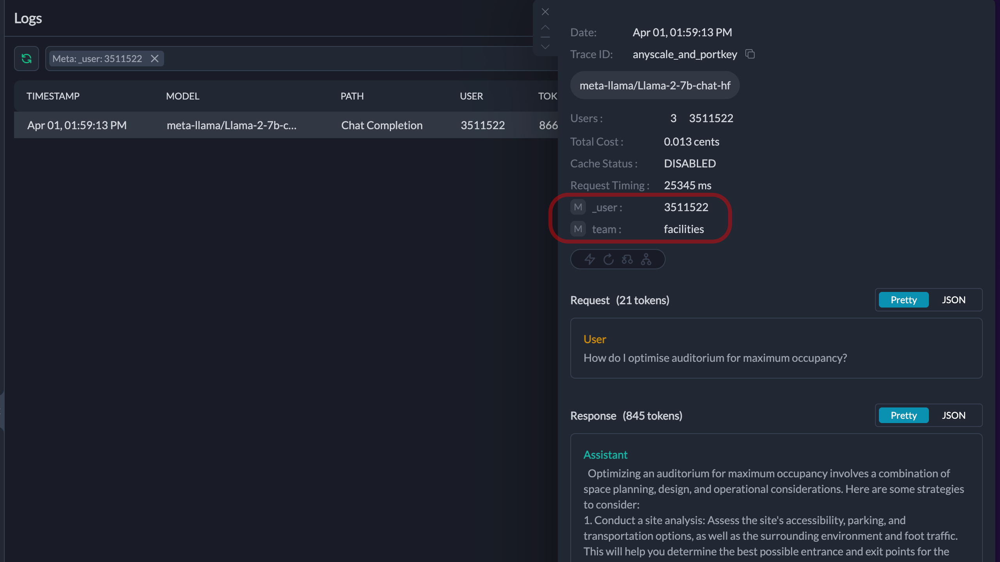
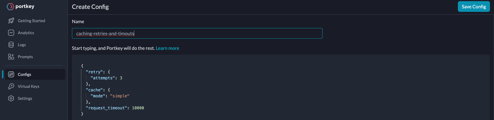

# A guide to using Anyscale with Portkey

## LLMs in Production

Anyscale provides inference APIs to the popular open-source LLMs. Keeping track of token costs, operating with various models, and monitoring and improving your app can be challenging. With Portkey, you get features that will help you solve these production challenges in minutes.

Dive into this guide for a comprehensive view of everything you could do with Portkey. Let's go!

## Portkey

Portkey provides an Observability suite and AI gateway capabilities for your gen-AI apps in production. It allows you to analyze all the logs and get power analytics on top of them. Not only can all your requests be served from the cache, but traffic can also be load-balanced, and fallbacks can be applied to improve reliability and save costs. These are just a few of the many features that Portkey has to offer.

## Integration with Anyscale

The easiest way to get Portkey working for you is through it’s client SDK, available for both NodeJS and Python.

To install them:

```sh
#python
pip install portkey_ai

#javascript
npm install portkey-ai
```

Get [Portkey API Key](https://portkey.ai/docs/api-reference/authentication#obtaining-your-api-key), and instatiate it to start using it make chat completions calls.

NodeJS:

```js
import { Portkey } from 'portkey-ai';

let PORTKEY_API_KEY = '<PORTKEY_API_KEY_HERE>';
let ANYSCALE_API_KEY = '<ANYSCALE_API_KEY_HERE>';

const portkey = new Portkey({
  apiKey: `${PORTKEY_API_KEY}`,
  provider: 'anyscale', // Provider Name
  Authorization: `Bearer ${ANYSCALE_API_KEY}` // Provider API Key
});

const response = await portkey.chat.completions.create({
  model: 'meta-llama/Llama-2-7b-chat-hf',
  messages: [{ role: 'user', content: "c'est la vie" }]
});

console.log(response.choices[0].message.content);
```

Python:

```py
from portkey_ai import Portkey

PORTKEY_API_KEY='<PORTKEY_API_KEY_HERE>'
ANYSCALE_API_KEY='<ANYSCALE_API_KEY_HERE>'

portkey = Portkey(
    api_key=PORTKEY_API_KEY,
    provider="anyscale",
    Authorization=f"Bearer {ANYSCALE_API_KEY}"
)

response = portkey.chat.completions.create(
    model="meta-llama/Llama-2-7b-chat-hf",
    messages = [{ "role": "user", "content": "c'est la vie" }]
)

print(response.choices[0].message.content)
```

### Virtual Keys

With Portkey Vault, your Anyscale API Key is stored safely and a Virtual Key is generated for you. The Virtual Key has many advantages such as the ability to rotate keys easily, multiple virtual keys for a single API key, and the option to impose restrictions based on cost, request volume, and user volume.

Learn [how to create Virtual Keys](https://portkey.ai/docs/product/ai-gateway-streamline-llm-integrations/virtual-keys#using-virtual-keys) and use them for your requests.

## Observability

Portkey can help you keep better track of your information and ensure that you're not missing out on any valuable insights.

1. Understand the number of tokens used and the nature of the token-costs attached.
2. Know when and what has caused an issue in production and troubleshoot it.
3. Analyze the status of each request and replay them as necessary.

There’s more to what you can do.

### Logging

Every request through Portkey to Anyscale will appear as a Log in the **Logs** page. Each log gives insights about the request and response body, timestamps, request timings, tokens, costs, and many more details.

<span style="text-decoration:underline;">NodeJS</span>

```js
const response = await portkey.chat.completions.create({
  model: 'meta-llama/Llama-2-7b-chat-hf',
  messages: [{ role: 'user', content: "c'est la vie" }]
});

console.log(response.choices[0].message.content);
```

<span style="text-decoration:underline;">Python</span>

```py
response = portkey.chat.completions.create(
    model="meta-llama/Llama-2-7b-chat-hf",
    messages = [{ "role": "user", "content": "c'est la vie" }]
)

print(response.choices[0].message.content)
```

Here is a screenshot of it:



### Tracing

Using Tracing abilities, you can pinpoint and analyze requests throughout their life-cycle and quickly filter through the heap of logs.

<span style="text-decoration:underline;">NodeJS</span>

```js
const response = await portkey.chat.completions.create(
  {
    model: 'meta-llama/Llama-2-7b-chat-hf',
    messages: [{ role: 'user', content: 'Greet me in Japanese' }]
  },
  {
    traceID: 'anyscale_and_portkey'
  }
);

console.log(response.choices[0].message.content);
```

<span style="text-decoration:underline;">Python</span>

```py
response = portkey.with_options(
  trace_id="anyscale_and_portkey"
).chat.completions.create(
    model="meta-llama/Llama-2-7b-chat-hf",
    messages = [{ "role": "user", "content": "Greet me in Japanese!" }]
)

print(response.choices[0].message.content)
```

Here is a screenshot:



### Metadata

Segment your requests and analyze them by attaching Metadata. They can describe anything that might be of valuable insight to you. For example, using metadata is the best answer if you want to segment the conversations related to a specific user.

<span style="text-decoration:underline;">NodeJS</span>

```js
const response = await portkey.chat.completions.create(
  {
    model: 'meta-llama/Llama-2-7b-chat-hf',
    messages: [{ role: 'user', content: 'How do I optimise auditorium for maximum occupancy?' }]
  },
  {
    traceID: 'anyscale_and_portkey',
    metadata: {
      _user: '3511522',
      team: 'facilities'
    }
  }
);

console.log(response.choices[0].message.content);
```

<span style="text-decoration:underline;">Python</span>

```py
response = portkey.with_options(
  trace_id="anyscale_and_portkey",
  metadata={
    "_user": "3511522",
    "team": "facilities"
  }
).chat.completions.create(
    model="meta-llama/Llama-2-7b-chat-hf",
    messages = [{ "role": "user", "content": "Greet me in Japanese!" }]
)

print(response.choices[0].message.content)
```

Filter through the logs using the metadata:



For comprehensive information and more features, see the [Observability docs](https://portkey.ai/docs/product/observability-modern-monitoring-for-llms).

## Production Reliability

Portkey’s multimodal AI gateway lets you tackle failure scenarios and make your app more reliable and robust.

- AI gateway can cache LLM responses and serve them instantly.
- Furthermore, it can enable your app to switch from one LLM to another in case of unexpected failures, ensuring uninterrupted service.
- Additionally, it can distribute incoming traffic evenly among the target LLMs, allowing for efficient load balancing.

### Caching, Retries, Request Timeouts

It’s easy to enable these features on your requests using [Gateway Configs](). From your Portkey **Dashboard**, on **Configs** and write the following JSON:

```json
{
  "retry": {
    "attempts": 3
  },
  "cache": {
    "mode": "simple"
  },
  "request_timeout": 10000
}
```

Hit **Save Config** and get a Config ID.



When making requests to the AI gateway, including the Config ID is essential. This will enable caching, timeouts, and automatic retries.

### Fallbacks and Loadbalancing

Similar to how you added features such as caching for your requests, bringing the power of Fallbacks and Load balancing is just as simple. Both are powerful means to build reliability into your system.

<span style="text-decoration:underline;">Fallbacks</span>

```json
{
  "strategy": {
    "mode": "fallback"
  },
  "targets": [
    {
      "virtual_key": "anyscale-virtual-key",
      "override_params": {
        "model": "meta-llama/Llama-2-70b-chat-hf"
      }
    },
    {
      "virtual_key": "openai-virtual-key",
      "override_params": {
        "model": "gpt-4"
      }
    }
  ]
}
```

<span style="text-decoration:underline;">Loadbalancing</span>

```json
{
  "strategy": {
    "mode": "loadbalance"
  },
  "targets": [
    {
      "virtual_key": "anyscale-virtual-key",
      "override_params": {
        "model": "meta-llama/Llama-2-70b-chat-hf"
      },
      "weight": 0.7
    },
    {
      "virtual_key": "openai-virtual-key",
      "override_params": {
        "model": "gpt-4"
      },
      "weight": 0.3
    }
  ]
}
```

You can reference them in the code as follows:

<span style="text-decoration:underline;">NodeJS</span>

```js
const portkey = new Portkey({
  apiKey: `${PORTKEY_API_KEY}`,
  provider: 'anyscale',
  Authorization: `Bearer ${ANYSCALE_API_KEY}`,
  config: PORTKEY_GATEWAY_CONFIG_ID // pc-cachin-15cc0a
});

const response = await portkey.chat.completions.create(
  {
    model: 'meta-llama/Llama-2-7b-chat-hf',
    messages: [{ role: 'user', content: "Greet me in a language I don't know" }]
  },
  {
    traceID: 'anyscale_and_portkey'
  }
);

console.log(response.choices[0].message.content);
```

<span style="text-decoration:underline;">Python</span>

```py
portkey = Portkey(
    api_key=PORTKEY_API_KEY,
    provider="anyscale",
    Authorization=f"Bearer {ANYSCALE_API_KEY}",
    config=CONFIG_ID
)

response = portkey.chat.completions.create(
    model="meta-llama/Llama-2-7b-chat-hf",
    messages = [{ "role": "user", "content": "Greet me in a language I don't know" }]
)

print(response.choices[0].message.content)
```

## Continous Improvement

Assessing the user impact of your prompts can be a difficult task, as certain prompts may have great user delight while others may lack it.

But what if your users could rate the quality of the responses provided by your LLMs? With Portkey, this is possible. By collecting user feedback, you can fine-tune your models and continuously improve their accuracy through autonomous fine-tuning. In other words, user feedback becomes the dataset used to train these models.

### Collect Feedback

We previously passed a trace ID (`anyscale_and_portkey`) in our requests. Portkey’s feedback method can attach feedback to as follows:

<span style="text-decoration:underline;">NodeJS</span>

```js
portkey.feedback.create({
  traceID: 'anyscale_and_portkey',
  value: 5 // Integer between -10 and 10
});
```

<span style="text-decoration:underline;">Python</span>

```py
feedback = portkey.feedback.create(
    trace_id="anyscale_and_portkey",
    value=5,  # Integer between -10 and 10
)
```

Connect any user interaction to record feedback on your response quality. You can also view feedback in the dashboard under the Feedback tab.

### Autonomous Fine-Tuning

Our Fine-Tuning feature can automatically fine-tune models based on feedback. It is currently in a private beta phase. If you are interested, please message us on support@portkey.ai or on our [Discord](https://discord.gg/DD7vgKK299) channel.

## Conclusion

Portkey is an excellent tool that applies production-grade features on top of Anyscale Models. What we have here is just tip of the iceberg. You can read about more exciting ways to use in [Portkey Documentation](https://portkey.ai/docs).
