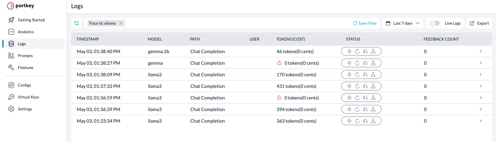
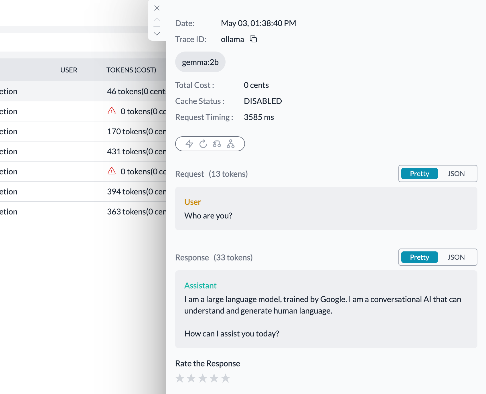
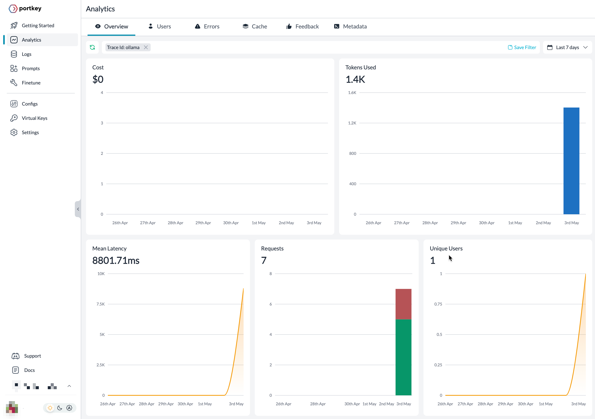

# Inspect local LLMs over Ollama

Ollama lets you run Large Language Models (from its [Model Library](https://github.com/ollama/ollama?tab=readme-ov-file#model-library)) locally on your computer. In this notebook, learn how to get valuable insights such as latencies, tokens, and so on for Observability.

We will go through two examples— the Llama and Gemma models.

Let’s get started.

## Installation and setup

See the [installation instructions](https://github.com/ollama/ollama/blob/main/README.md#macos) for installing Ollama for your operating system. Once installed, run any model from its library and Chat with LLama 3 on the terminal.

```sh
$ ollama run llama3
>>> Hello Llama
Hello there! *ears perked up* It's lovely to meet you! How are you today?

>>>
```

Ollama will download the model the first time you run it.

Install the Portkey SDK

```sh
npm install portkey-ai
```

## Create a Public URL for local LLM

By default, Ollama runs the LLMs locally on `localhost`. Exposing the LLMs to the internet using `ngrok` will make it accessible through tools like Portkey.

[Get ngrok](https://ngrok.com/download) and run the following command in a new terminal tab while Ollama is running in parallel:

```sh
ngrok http 11434 --host-header="localhost:11434"
```

The port `11434` is the default that Ollama uses to run LLMs locally. Change accordingly in case a different port is used.

```sh
K8s Gateway API support available now: https://ngrok.com/r/k8sgb

Session Status                online
Account                       Shaik Saif Ali (Plan: Free)
Version                       3.9.0
Region                        India (in)
Latency                       23ms
Web Interface                 http://127.0.0.1:4040
Forwarding                    https://a9b5-13-234-188-229.ngrok-free.app -> http://localhost:11434

Connections                   ttl     opn     rt1     rt5     p50     p90
                              3       0       0.00    0.00    28.67   97.85

HTTP Requests
-------------

POST /v1/chat/completions      200 OK
```

## Create chat completions

Next up, Configure `<subdomain>.ngrok-free.app` as `customHost` at Portkey client instantiation. The `traceID` lets you filter the logs in the Portkey app.

[Sign up](https://www.portkey.ai) and get Portkey API Key

### Llama 3

```js
import { Portkey } from 'portkey-ai';

const portkey = new Portkey({
  apiKey: process.env.PORTKEY_API_KEY,
  provider: 'ollama',
  customHost: 'https://a9b5-13-234-188-229.ngrok-free.app',
  traceID: 'ollama'
});

const chatCompletion = await portkey.chat.completions.create({
  messages: [{ role: 'user', content: 'Why is the sky blue?' }],
  model: 'llama3'
});

console.log(chatCompletion.choices[0].message.content);
```

On the console:

```sh
> node ollama.js
What a great question!

The color of the sky appears blue to us because of <truncated>
```

### Gemma

```js
import { Portkey } from 'portkey-ai';

const portkey = new Portkey({
  apiKey: process.env.PORTKEY_API_KEY,
  provider: 'ollama',
  customHost: 'https://a9b5-13-234-188-229.ngrok-free.app',
  traceID: 'ollama'
});

const chatCompletion = await portkey.chat.completions.create({
  messages: [{ role: 'user', content: 'Who are you?' }],
  model: 'gemma:2b'
});

console.log(chatCompletion.choices[0].message.content);
```

On the console:

```sh
I am a large language model, trained by Google. I am a conversational AI that can understand and generate human language.

How can I assist you today?
```

### Others

Use the model identifiers form this command [reference](https://github.com/ollama/ollama/blob/main/README.md#model-library) and pass arguments to the model parameter ( `ollama run <identfier>` ).

```js
const chatCompletion = await portkey.chat.completions.create({
  messages: [{ role: 'user', content: 'Who are you?' }],
  model: '<model-identifier>'
});
```

## Observability on Portkey

The `ollama` trace ID lets you filter the desired logs.

The Logs page lists timestamps, models, tokens and operations in one view. Status highlights the activated AI gateway activity such as caching, retries, fallbacks or loadbalancing. To learn more refer to the [docs](https://portkey.ai/docs/product/ai-gateway-streamline-llm-integrations).



Each log gives in-depth details (toggle JSON) about each request including the time taken for request to finish.



See holistic picture through mean latency, requests, unique users, tokens used and much more along on the dashboard.


