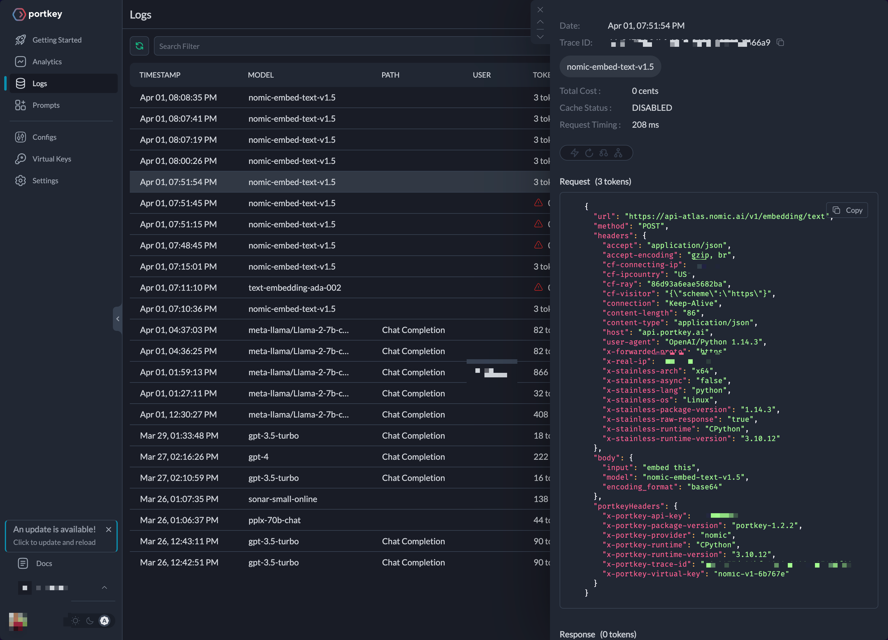
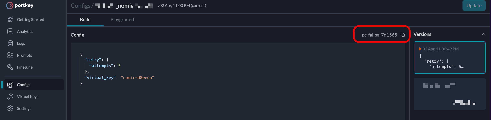

# Switch from OpenAI to Nomic Embeddings

OpenAI Embeddings is the champion for embedding workflows for generative AI applications. The teams that require the auditabilitiy of model weights and training data for compliance and security reasons are not available with OpenAI’s closed-source models.

[Nomic Embed](https://huggingface.co/nomic-ai/nomic-embed-text-v1) is an open-source embedding model with open training data and is fully reproducible and auditable. This text embedding model has an 8192 context length and [outperforms](https://blog.nomic.ai/posts/nomic-embed-text-v1) OpenAI Ada-002 and text-embedding-3-small in short and long context tasks.

Chances are, if you are already using OpenAI’s Ada, trying out Nomic Embed is simple with [Portkey](https://portkey.ai/).

To integrate with Nomic AI:

1. Log into to the Portkey **Dashboard** and
2. Click **Virtual Keys**
   1. Save Nomic API Key
   2. Copy the **Virtual Key**
3. Copy the **Portkey API key** from the profile options.

## Ada to Nomic in minutes.

Switching to Nomic Embed from OpenAI's embedding models is easy without leaving the OpenAI SDK. Portkey will automatically re-route your requests to the Nomic Embed model by updating the base URL.

Here's how to do it with just a few lines of code:

```py
from portkey_ai import PORTKEY_GATEWAY_URL, createHeaders
from openai import OpenAI

PORTKEYAI_API_KEY="PORTKEY_API_KEY_HERE"
NOMICAI_VIRTUAL_KEY="NOMIC_API_KEY_HERE"


client = OpenAI(
    api_key="<ignored>", # instead, virtual key is respected
    base_url=PORTKEY_GATEWAY_URL,
    default_headers=createHeaders(
        api_key=PORTKEYAI_API_KEY,
        virtual_key=NOMICAI_VIRTUAL_KEY,
    )
)

embeddings = client.embeddings.create(
    input='embed this',
    model='nomic-embed-text-v1.5'
)

print(embeddings.data)
```

There is no requirement for further modifications in the rest of your codebase.

## View the Logs

Each request made through Portkey to Nomic generates a log entry in the Logs page. These logs provide information about the request and response body, timestamps, request timings, tokens, costs, and other details.

You can identify the cause of production issues and enable efficient troubleshooting. Head to the [documentation](https://portkey.ai/docs/product/observability-modern-monitoring-for-llms) to explore more features like analytics, tracking, feedback, and custom metadata.

Here is a screenshot:



## Retry Requests automatically

In the cases of unexpected failures in generating the embeddings, Portkey will automatically retry the requests. To enable this feature on your requests, create gateway configs:

From your Portkey **Dashboard**, on **Configs** and write the following JSON:

```json
{
  "retry": {
    "attempts": 5
  },
  "virtual_key": "nomic-d8eeda"
}
```

Hit **Save Config** and get a Config ID.



The Config ID can now be referenced during client instance instantiation:

```py
CONFIG_ID="pc-fallba-7d1565"

client = OpenAI(
    api_key="<ignored>", # instead, virtual key is respected
    base_url=PORTKEY_GATEWAY_URL,
    default_headers=createHeaders(
        api_key=PORTKEYAI_API_KEY,
        virtual_key=NOMICAI_VIRTUAL_KEY,
        config=CONFIG_ID
    )
)

embeddings = client.embeddings.create(
    input='embed this',
    model='nomic-embed-text-v1.5'
)

print(embeddings.data)
```

Thanks to Portkey's AI gateway, requests to Nomic are automatically retried.

You can do more with Portkey’s AI gateway, such as caching, timeouts, etc. Explore them in detail in the [docs](https://portkey.ai/docs/product/ai-gateway-streamline-llm-integrations).

## Conclusion

Nomic is excellent and better by [benchmarks](https://blog.nomic.ai/posts/nomic-embed-text-v1) than OpenAI’s text embedding models. With Portkey, you can transition within minutes and get a production-grade AI gateway for all apps. You can read about exciting ways to power your apps on the [Portkey documentation](https://portkey.ai/docs).
