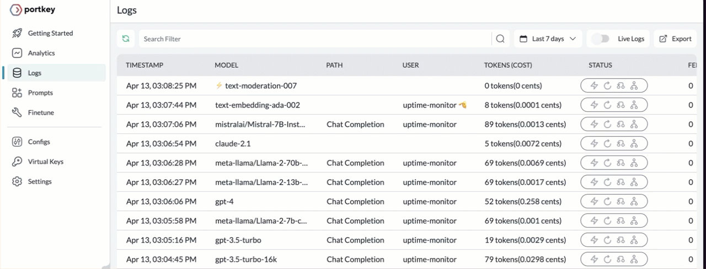

# How to monitor dev, staging, and production environments

Having different environments in the software development for your LLM apps lets you ensure high-quality software delivery. These environments are isolated and allow teams to manage risks more effectively by catching and addressing issues at the earliest possible stages. Portkey lets you monitor logs of all interactions with any LLM and generate actionable insights for troubleshooting, improving performance, ensuring security & compliance and much more.

In this cookbook, we will learn to integrate Portkey into our LLM app and use custom metadata to monitor logs of every environment.

<span style="text-decoration:underline;">Prerequisites</span>:

1. You should have the [Portkey API Key](https://portkey.ai/docs/api-reference/authentication#obtaining-your-api-key).
2. Get an [Virtual Key](https://portkey.ai/docs/product/ai-gateway-streamline-llm-integrations/virtual-keys) for your OpenAI Keys. It lets you easily rotate, and impose usage based restrictions.

## 1. Import the SDK and authenticate Portkey

Start by installing the `portkey-ai` to your NodeJS project.

```sh
npm i --save portkey-ai
```

Once installed, you can import and instantiate it with the API key to your Portkey account.

```js
import { Portkey } from 'portkey-ai';

const portkey = new Portkey({
  apiKey: 'PORTKEY_API_KEY',
  virtualKey: 'OPENAI_VIRTUAL_KEY_HERE'
});
```

## 2. Define your app environment

Portkey logs every request on the Logs page in the Portkey app. To monitor and filter the logs based on the environment in which the app is deployed, you can add metadata about the environment to your requests.

```js
const requestOptions = {
  metadata: {
    _user: 'USER_ID',
    environment: 'dev'
  }
};
```

Notice the `environment` key in the `metadata` . You can pass values such as `dev`, `staging,` and `prod` to categorize the interactions with LLMs, respectively. The metadata can be enhanced by adding any number of key-value pairs. However, each string's maximum length should not exceed 128 characters. In this example, the `_user` key lets you filter the requests made by a specific user.

For more information, refer to the [Metadata](https://portkey.ai/docs/product/observability-modern-monitoring-for-llms/metadata) docs.

## 3. Make a Request to Dev Environment

The `requestOptions` contains the `metadata` that is to be passed as an argument in a API call through Portkey SDK. For example, see the following code snippet demonstrating the chat completions.

```js
const messages = [
  {
    role: 'system',
    content: 'You are a very helpful assistant.'
  },
  {
    role: 'user',
    content: 'What are 7 wonders in the world?'
  }
];

const requestOptions = {
  metadata: {
    _user: 'USER_ID',
    environment: 'dev'
  }
};

const response = await portkey.chat.completions.create(
  {
    messages: [{ role: 'user', content: 'What are 7 wonders in the world?' }],
    model: 'gpt-4'
  },
  requestOptions
);

console.log(response.choices[0].message.content);
// The Seven Wonders of the Ancient World are:
```

## 4. Switch environment to Production

What if the requests are sent in the apps deployed in production? You can use the environment variables to pass the `production` identifier automatically.

```js
const requestOptions = {
  metadata: {
    _user: 'USER_ID',
    environment: 'production'
  }
};
```

The rest of the API calls to chat completions or getting embeddings do not require any additional changes.

```js
const response = await portkey.chat.completions.create(
  {
    messages: [{ role: 'user', content: 'What are 7 wonders in the world?' }],
    model: 'gpt-4'
  },
  requestOptions
);
```

## 5. Monitor the environments

It’s now straightforward to filter all the activity based on the metadata.

1. Go to **Logs**
2. Click on the _Search Filter input box_ and select **Meta** from drop down.
   1. You can select the key-value combinations
   2. Select **Update**
3. View the logs based on filters applied.



Similarly, you can update the value to be `staging` or `production` as an convention to list the logs. Toggle the _Live Logs_, which is especially if you are debugging and reproducing a bug live.
