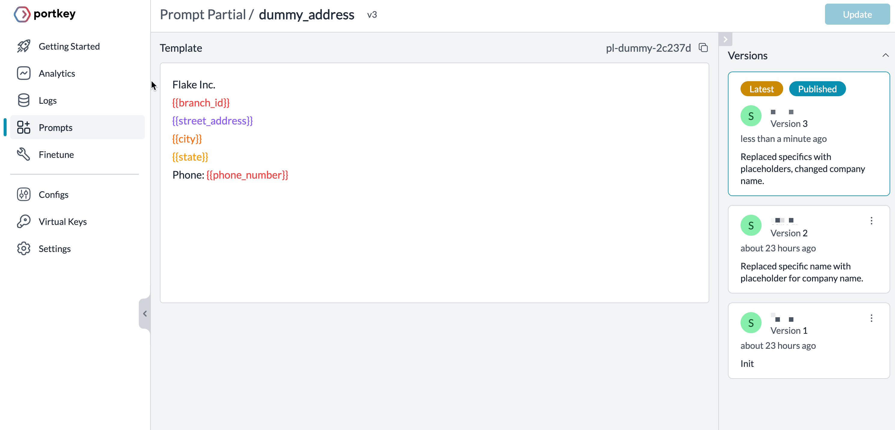
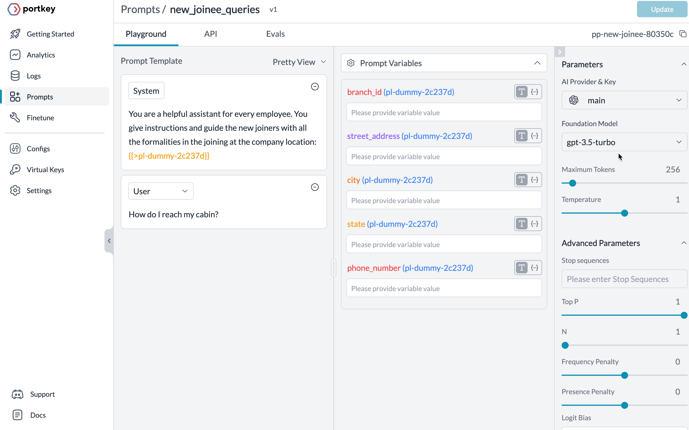
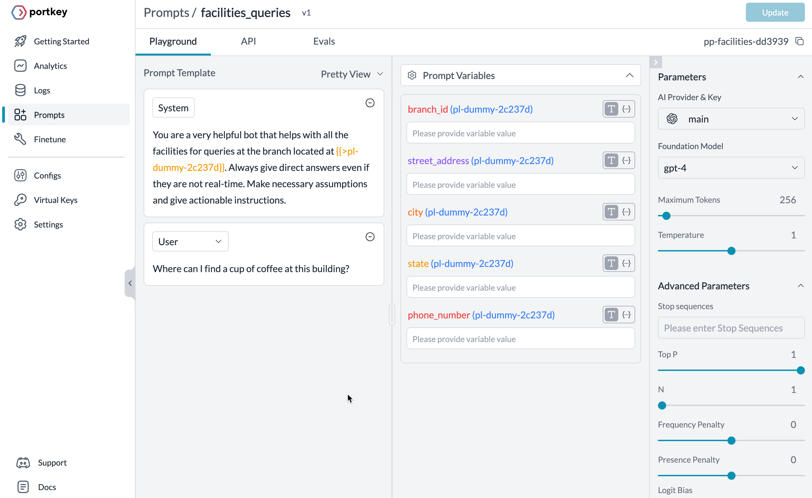

# Using prompt partials

Prompt partials are reusable text snippets you can refer to in multiple prompts — `system`, `user,` or `assistant` messages. It decouples the prompts and partials from the business logic and allows the updates independently.

This notebook demonstrates how to use prompt partials in the prompts you create on the Portkey app. Also, trigger two prompt completion endpoints that refer to common prompt partial and output the response.

## Prerequisites

Get an account by [signing up](https://www.portkey.ai) for the Portkey app and Integrate OpenAI by storing its API keys in the _Virtual Keys_ page. They are identifiers to the API key but can apply custom restrictions based on token usage and [other factors](https://docs.portkey.ai/docs/product/ai-gateway-streamline-llm-integrations/virtual-keys).

Portkey SDK lets you trigger the prompts. Install the SDK:

```sh
npm install portkey-ai
```

## Creating prompt partials

Start by creating a partial list of commonly used information across multiple prompts.

For example, to create a prompt particle of an address:

Prompts > Prompt Partials (Tab) > Create



Use [mustache](https://www.tsmean.com/articles/mustache/the-ultimate-mustache-tutorial/) syntax to declare variables to input values at runtime. Once saved, get a unique identifier for the partial ID (pl-dummy-2c237d).

Every update saves a version of the partial description that you can always roll back on demand.

## Reference partials in the prompt templates

The prompt playground is an easy way to experiment with input messages and suitable models. Once you find the desired model and hyperparameters, save them as a prompt template and get API to access them programmatically.

<span style="text-decoration:underline;">Example Prompt Template - 1</span>

The system prompt instructs the model to act as an assistant for a new joiner.

Reference the prompt partial in the instructions that list the prompt variables. In this case, the varying details of the address are variables.

Try the prompt until the desired output and save it. Again, once saved, get a unique ID.



<span style="text-decoration:underline;">Example Prompt Template - 2</span>

Similarly, another prompt template can help with queries related to facilities.



## Trigger the prompt

Let’s trigger the prompt completion to get the response to a facilities-related query. Using the prompt templates we created earlier:

```js
import Portkey from 'portkey-ai';

const portkey = new Portkey({
  apiKey: process.env['PORTKEY_API_KEY']
});

const messages = [
  {
    role: 'user',
    content: 'How do I reach the cafeteria?'
  }
];

const promptCompletion = await portkey.prompts.completions.create({
  promptID: 'pp-facilities-dd3939',
  variables: {
    branch_id: '4325',
    street_address: 'Alighar Road, Delta Towers',
    city: 'Delhi',
    state: 'Delhi',
    phone_number: '8837'
  }
});

console.log(promptCompletion.choices[0].message.content);
```

Log

```md
Sure, in the Delta Tower building of Flake Inc., you can head to the cafeteria located on the 3rd floor. Our cafeteria serves freshly brewed coffee every day during work hours (8 AM to 6 PM). You can also use the coffee vending machine available in the common area on the 5th floor as well. Please ensure you have your access card for the cafeteria.
```
