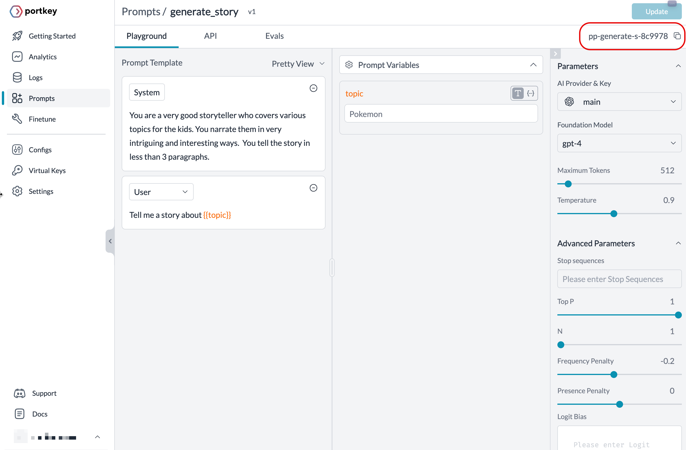

# Rendering prompts

Portkey lets you experiment with the prompts and automatically convert them into production-ready API. The completion calls to the API will fetch you the responses from your favorite LLM provider.

This notebook demonstrates how to retrieve the prompt details in a JSON response and use OpenAI Node SDK for chat completions.

## 0. Get Prompt ID

To get a prompt ID, create one from the Portkey app and copy it to the clipboard.



## 1. Install the Portkey and OpenAI SDKs

```sh
npm install portkey-ai openai
```

## 2. Import and authenticate Portkey

```js
import Portkey from 'portkey-ai';

const portkey = new Portkey({
  apiKey: '<PORTKEY_API_KEY>'
});
```

## 3. Retrieve the Prompt

**Using Portkey SDK**

`portkey.prompts.render({..})` method returns a JSON with all the details such as input, messages, temperature, max tokens, n, frequency & presence penalties. The variables in the _messages_ are substituted at the runtime, and rendered prompt details are returned along with the response.

You can further set the values in the response by passing the model parameters alongside `variables`.

```js
const render = await portkey.prompts.render({
  promptID: 'PROMPT_ID',
  variables: { topic: 'Tom and Jerry' }
  // model: “gpt-3.5-turbo”
});

console.log(render.data);
```

**Using REST Endpoint**

```js
const url = `https://api.portkey.ai/v1/prompts/<PROMPT_ID>/render`;
const data = {
  variables: { topic: 'Tom and Jerry' }
  // model: "gpt-3.5-turbo"
};

const headers = {
  'Content-Type': 'application/json',
  'x-portkey-api-key': '<PORTKEYAI_API_KEY>'
};

let render = await axios.post(url, data, { headers });

console.log(render.data.data);
```

**Response**

```sh
{
  model: 'gpt-4',
  n: 1,
  top_p: 1,
  max_tokens: 512,
  temperature: 0.9,
  presence_penalty: 0,
  frequency_penalty: -0.2,
  messages: [
    {
      role: 'system',
      content: 'You are a very good storyteller who covers various topics for the kids. You narrate them in very intriguing and interesting ways.  You tell the story in less than 3 paragraphs.'
    },
    { role: 'user', content: 'Tell me a story about Tom and Jerry' }
  ]
}
```

## 4. Trigger the Prompt

Make chat completions to any LLM [mostly](https://portkey.ai/docs/welcome/integration-guides) using OpenAI SDK client through Portkey. You can trigger an completion using the `chat.completions.create({..})`.

```js
import OpenAI from 'openai';
import { PORTKEY_GATEWAY_URL, createHeaders } from 'portkey-ai';

const client = new OpenAI({
  apiKey: 'USES_VIRTUAL_KEY',
  baseURL: PORTKEY_GATEWAY_URL,
  defaultHeaders: createHeaders({
    provider: 'openai',
    apiKey: `${PORTKEYAI_API_KEY}`,
    virtualKey: `${OPENAI_VIRTUAL_KEY}`
  })
});
```

Pass the rendered prompt details as an argument.

```js
const url = `https://api.portkey.ai/v1/prompts/${PROMPT_ID}/render`;

const headers = {
  'Content-Type': 'application/json',
  'x-portkey-api-key': PORTKEYAI_API_KEY
};
const data = {
  variables: { topic: 'Tom and Jerry' }
};

let render = await axios.post(url, data, { headers });

const promptDetail = render.data.data;
const chatCompletion = await client.chat.completions.create(promptDetail);
return chatCompletion.choices[0].message.content;
```

Learn more about how to use [OpenAI SDK for Portkey](https://portkey.ai/docs/welcome/integration-guides/openai#using-the-portkey-gateway) and [Virtual Keys](https://portkey.ai/docs/product/ai-gateway-streamline-llm-integrations/virtual-keys).

**Response**

```md
In a small, peaceful town lived two mischievous friends, Tom the cat and Jerry the mouse. They weren't your usual cat and mouse, they were best friends! Tom, who could be described as the bighearted goof, and Jerry, the tiny little mouse with a huge heart and great wisdom, were famous for their playful antics.

One sunny day, they discovered a treasure map painted on the old town wall. They decided to follow the map, which, to their surprise, led them to the back of their own house. They dug up and found a chest full of delicious food and refreshing drinks. They had a grand feast and shared the food with the whole town, bringing joy and smiles. It was known as the best day ever in the town, all thanks to our heroes, Tom and Jerry.
```

You’ve now successfully learned to render the prompt details and use them to call the chat completions API. You can now render the prompt details from your library and use them in your use-cases.
