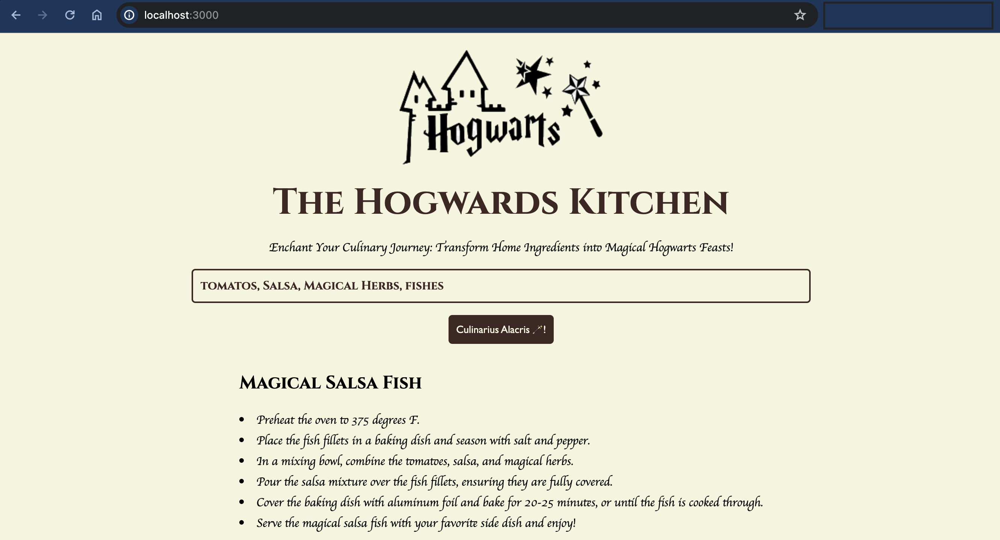

## The Hogwards Kitchen


This web app helps you find new and delicious recipes to cook, based on the ingredients you have on hand. Simply enter your ingredients into the search bar, and the app will return a list of recipes that you can make. The catch? In Hogwarts style!

## Flow


# Try it out

## Prerequisites

- This project is built using [bun package manager](https://bun.sh/docs/installation).
- An OpenAI [API Key](https://help.openai.com/en/articles/4936850-where-do-i-find-my-api-key)
- An API Key from [Portkey](https://portkey.ai/)

## Instructions

```sh
# clone the repository and then,
cd the-hogwarts-kitchen

# install dependencies from root
bun install

# substitute API keys
echo "OPENAI_API_KEY=your_openai_api_key" >> .env
echo "PORTKEYAI_API_KEY=your_portkeyai_api_key" >> .env

# run the app
bun start
```

**Bonus**: Open `Portkey > Dashboard > Logs`, to see the all the requests facilitated by portkey and serving from cache to save to tokens, hence, `$$$`.
